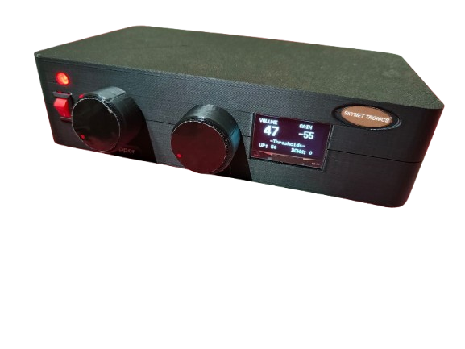

# 🔊 AUTOMATED SOUND REGULATOR

  

## Project Header

**Skynet Tronics** presents a project for the **EN-1190 ENGINEERING DESIGN PROJECT** module.

**Institution:** University of Moratuwa

**Team Members:**
*   H.A.P. Aroshana (230058N)
*   H.D.J.D. Samaranayaka (230563Η)
*   W.M.H. Wanigasundara (230680M)
*   A.H.T.M. Weerakoon (230689A)

---

## Project Overview

### Problem Statement

Effective communication is critical when addressing an audience. However, the acoustics of different spaces and variations in speaking styles and voice levels pose practical challenges. For instance, in a setting with multiple speakers, each might require a specific audio system setting, but a single technician can only provide fixed adjustments. This can lead to uneven audibility, reducing audience engagement and potentially causing hearing damage due to overamplification. Our research among stakeholders confirms that fluctuating sound levels are a common and widespread problem.

### Our Solution

To address this issue, we propose the development of an external volume adjustment device, which we have named the **Automated Sound Regulator (ASR)**. This standalone system is designed to be user-friendly, modular, and easy to integrate with existing audio setups without requiring modifications to the main amplifier.

---

## System Architecture

The ASR is designed to be an automated device with key components focusing on different aspects of signal processing. The main operational flow is as follows:

1.  **Signal Monitoring Unit:** Continuously samples the output signal from the main amplifier or a central sound source.
2.  **Threshold Analysis Module:** Determines if the current audio level is within an acceptable, calibrated range.
3.  **Dynamic Gain Adjustment Unit:** Automatically modifies the audio to maintain a stable, optimal output level.
4.  **Configuration and Calibration Setup:** Enables customization of the system's operational thresholds for different environments.

### Unique Value

Unlike typical audio solutions with fixed thresholds, our ASR offers a unique level of control with customizable, scene-specific calibration. As an external, standalone device, it provides dynamic adjustment without any need to replace or alter existing amplifiers. This makes it an affordable and highly adaptive solution for a variety of spaces, from small meeting rooms to large auditoriums.

---

## Design and Specifications

We focused heavily on the user interface and user experience, creating a design that is both functional and ergonomic. The device features a set of control knobs for min/max levels, clear input/output jacks, and built-in ventilation to ensure reliable performance. Its modular and compact design ensures it is easy to transport and deploy.

| Specification | Dimension |
| :--- | :--- |
| **Length** | 20 cm |
| **Height** | 6 cm |
| **Depth** | 15 cm |

---

  

